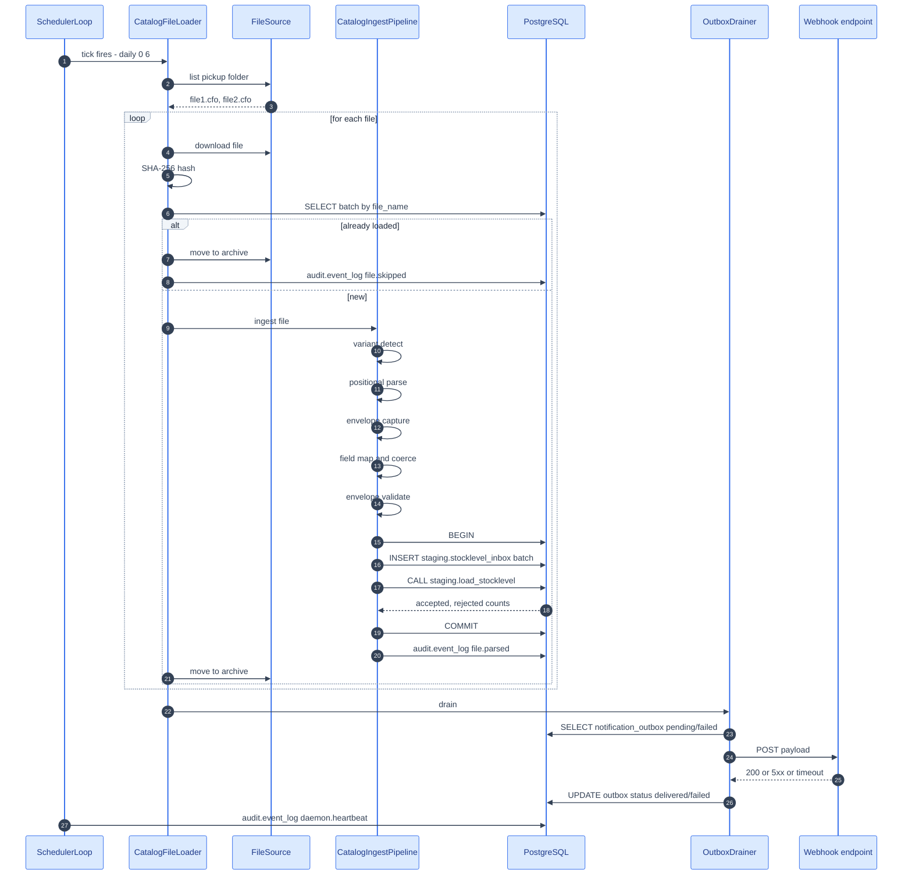
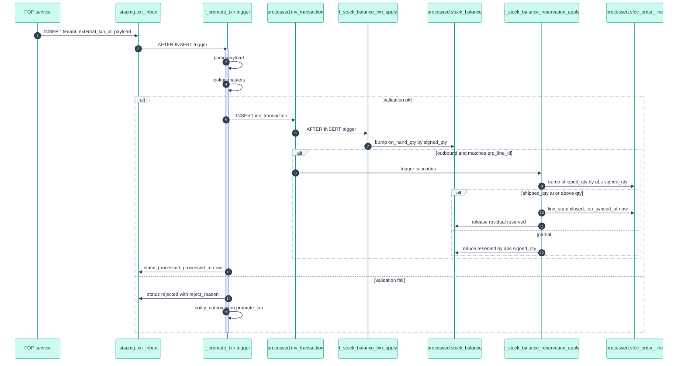
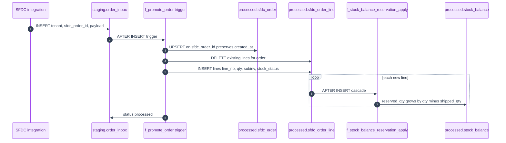
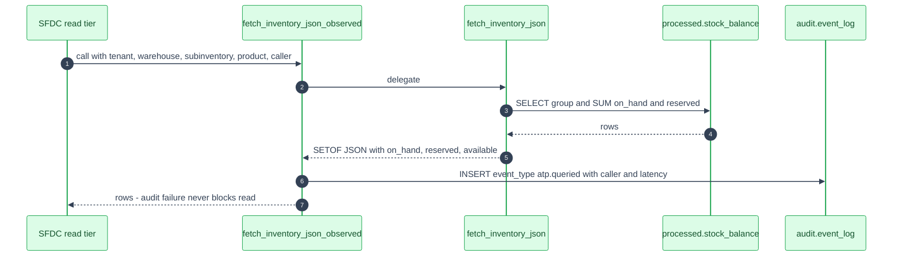
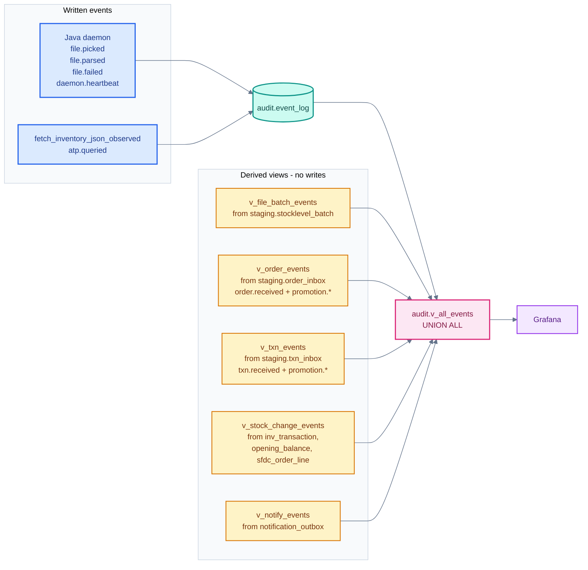
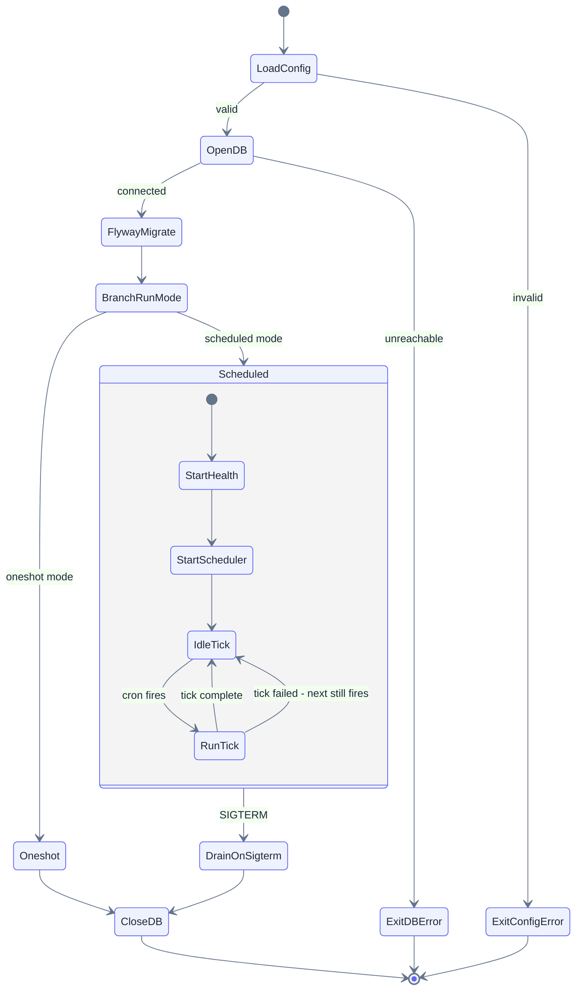

Six diagrams that show how the system actually behaves at runtime.

## 1. Scheduled file ingest — end to end

## 2. Transaction promotion — FOP to processed

FOP INSERTs into `staging.txn_inbox`. An AFTER INSERT trigger fires per row and drains synchronously into `processed.inv_transaction`. Reservation cascade happens automatically via the `f_stock_balance_txn_apply` trigger on the INSERT into `inv_transaction`.

## 3. Order lifecycle — SFDC to order and reservations

## 4. ATP read — SFDC quote screen to fetch_inventory_json

## 5. Observability event stream — audit.v_all_events

Grafana points its Postgres data source at `audit.v_all_events`. The view UNIONs the event log (Java-written) with derived views over the inbox, outbox, and transaction tables.

## 6. Startup and shutdown

