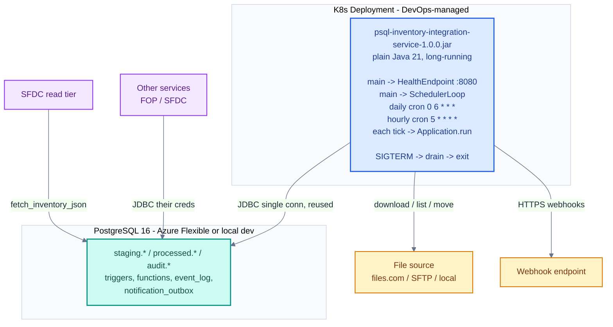

**Companion to:** [Spec](/overview/spec), [Scope](/overview/scope), [Flow diagrams](/architecture/flow-diagrams).

## Process topology



The pod stays up 24/7 (`RUN_MODE=scheduled`, prod default). PostgreSQL is always-on. Other services have their own lifecycle. **Container images, K8s YAML, secret sourcing, and centralized config layout are owned by the customer DevOps team** — our deliverable stops at the runnable JAR plus `/actuator/health`, documented env vars, and exit codes.

The legacy single-shot model survives as `RUN_MODE=oneshot` for dev / CI / ad-hoc backfill. Same JAR, same code paths — just runs once and exits.

## Java execution model

Two modes chosen at startup by the `RUN_MODE` env var. See [Run modes](/operations/run-modes) for a comparison.

### `RUN_MODE=scheduled` (prod default)

```
main()
 ├─ load Config (YAML + env vars + CONFIG_DIR overlay; validate; fail fast)
 ├─ open JDBC connection (1 connection, reused across runs)
 ├─ Flyway.migrate()              // idempotent; skipped if FLYWAY_ENABLED=false
 ├─ register shutdown hook        // SIGTERM → stop scheduler + health → close DB
 ├─ start HealthEndpoint (JDK HttpServer on HEALTH_HOST:HEALTH_PORT)
 ├─ start SchedulerLoop in its own thread:
 │    while not interrupted:
 │      compute earliest next-fire across all CronSchedule entries
 │      sleep until next-fire (interruptible)
 │      synchronized: run Application.run()
 │        ├─ for each file in FileSource.list():
 │        │    ├─ hash check (skip if seen)
 │        │    ├─ download → validate → COPY → CALL load_stocklevel
 │        │    └─ archive / reject + emit outbox row
 │        └─ drain notification_outbox
 │      log scheduled-run-complete (exit code, file count, latency)
 │      // failures here log WARN; loop continues to next tick
 └─ park main thread → SIGTERM unblocks → graceful shutdown → exit 0
```

### `RUN_MODE=oneshot` (dev / CI / ad-hoc default)

```
main()
 ├─ load Config
 ├─ open JDBC connection
 ├─ Flyway.migrate()
 ├─ Application.run()             // one pipeline pass
 ├─ close connection
 └─ exit 0   (non-zero on unrecoverable failure)
```

No scheduler, no HTTP server. Used by every existing unit / integration test and by `scripts/run-dev.sh`.

## Maven layout

```
inventoryledger/                            (parent POM, no code)
├── pom.xml                                 (packaging=pom; modules=core, data-tools)
├── SPEC.md / ARCHITECTURE.md / SCOPE.md / TEST-PLAN.md / TEST-RESULTS.md
├── docs/adr/0001…0014-*.md
├── deploy/{05..11}-06-v{1..6}-customer/    (customer schema snapshots)
├── db/                                     (dev-only Flyway migrations + seeds)
├── filemanager-core/                       ← production JAR (SHIPPED)
│   ├── pom.xml
│   ├── src/main/java/org/michelin/filemanager/…
│   ├── src/main/resources/interfaces/mich_inv_stocklevel_batch.yaml
│   └── src/test/java/…
└── filemanager-data-tools/                 ← synthetic data (DEV ONLY, never ships)
    ├── src/main/java/org/michelin/filemanager/tools/{GenerateOpeningBalance,LoadOrders,LoadTransactions}
    └── src/main/resources/tools.yaml
```

## `filemanager-core` package map

```
org.michelin.filemanager
├── App                          main; dispatches on RUN_MODE
├── Application                  composition root — single pipeline pass
├── config/                      Config record + ConfigLoader + Profile + Overlay
├── db/                          Database (JDBC helpers) + FlywayMigrator
├── file/                        FileSource interface + factory
│   ├── FilesComFileSource       production default (native SDK)
│   ├── FilesComSdkGateway       thin wrapper over com.files.Client
│   ├── FilesComGateway          interface for gateway (mockable)
│   ├── SftpFileSource           MINA-SSHD client
│   └── LocalFolderFileSource    dev / test
├── catalog/                     Catalog + CatalogLoader + InterfaceDefinition
│   ├── VariantDetector          filename pattern + header_confirms
│   ├── ColumnType               NUMERIC / DATE / TIMESTAMPTZ / TEXT
│   └── DetectionResult          Match(interface, variant) | None(reason)
├── parser/                      PositionalRecordParser (delimited + fixed-width)
├── mapper/                      FieldMapper + TypeCoercer + EnvelopeContext + MappedRow
├── ingest/                      CatalogIngestPipeline + CatalogFileLoader
│   ├── EnvelopeValidator        footer counts vs data row count
│   └── StagingWriter            JDBC INSERT into staging.stocklevel_inbox
├── pipeline/                    Archiver + NotificationEmitter
├── notifier/                    OutboxDrainer + webhook notifiers
│   ├── SingleUrlWebhookNotifier
│   ├── MultiUrlNotifier
│   ├── StatusTransitionPolicy
│   └── Severity                 INFO / WARN / ERROR
├── audit/                       Event + EventLogWriter + HeartbeatEmitter
├── scheduler/                   CronSchedule + SchedulerLoop (ADR-0014)
├── health/                      HealthStatus + HealthEndpoint (JDK HttpServer)
├── lifecycle/                   ExitCode + ExitCodeMapper
└── exception/                   Named exceptions per domain
```

Every class is plain Java. Constructor injection. No DI framework. Scheduler + health are isolated under their own packages so the `oneshot` path never touches them.

## Library map

| Concern | Library | Version | Notes |
|---|---|---|---|
| DB driver | `org.postgresql:postgresql` | 42.7.4 | JDBC 4.x; supports CopyManager |
| Migrations | `org.flywaydb:flyway-core` + `flyway-database-postgresql` | 10.20.1 | Idempotent; skipped if `FLYWAY_ENABLED=false` |
| JSON | `com.fasterxml.jackson.core:jackson-databind` | 2.17.2 | Records bind directly |
| Config YAML | `org.yaml:snakeyaml` | 2.3 | YAML → Map → validated `Config` record |
| Logging | `org.slf4j:slf4j-api` + `ch.qos.logback:logback-classic` + `net.logstash.logback:logstash-logback-encoder` | 2.0.16 / 1.5.12 / 7.4 | JSON logs in prod, plain in dev |
| SFTP | `org.apache.sshd:sshd-sftp` (MINA SSHD) | 2.13.2 | Modern, maintained |
| files.com | `com.files:files-sdk` | 1.6.24 | Native REST SDK |
| HTTP outbound | `java.net.http.HttpClient` (JDK) | 21 | Webhook notifier |
| Cron | `com.cronutils:cron-utils` | 9.2.1 | Standard 5-field cron |
| Tests | `org.junit.jupiter:junit-jupiter` + `org.testcontainers:postgresql` + `org.mockito:mockito-core` + `org.assertj:assertj-core` | 5.11.3 / 1.20.3 / 5.14.2 / 3.26.3 | |

Removed vs earlier drafts: HikariCP (no pool — one connection reused across runs), Micrometer + Prometheus (event log covers observability), OpenTelemetry agent (structured logs cover tracing).

No Quarkus, Spring, Micronaut, JPA, Hibernate, jOOQ, JDBI, Spring JDBC.

## Failure modes

| Failure | Detection | Recovery |
|---|---|---|
| DB unreachable | JDBC connection fails | Health probe returns 503; K8s restarts pod; next tick retries |
| Migration fails | Flyway throws | Startup fails with exit code 2; ops investigates. Skip with `FLYWAY_ENABLED=false` if DBServices owns schema. |
| files.com unreachable | SDK exception | Outbox row (best effort); scheduler continues; next tick retries |
| File validation fails | Envelope or parser exception | File moved to `reject/`; `file.failed` event written; processing continues with next file |
| `load_stocklevel` raises | JDBC SQLException | Whole file transaction rolls back; file moved to `reject/`; outbox row written |
| Webhook fails | HTTP non-2xx or timeout | Outbox row `retry_count++`, marked `failed`; next tick's drain retries; permanent fail after `max_retries` |
| Pod killed mid-run | SIGTERM handler | JVM shutdown hook closes JDBC; partially-loaded file rolls back (txn rollback); K8s restarts; next tick reprocesses |
