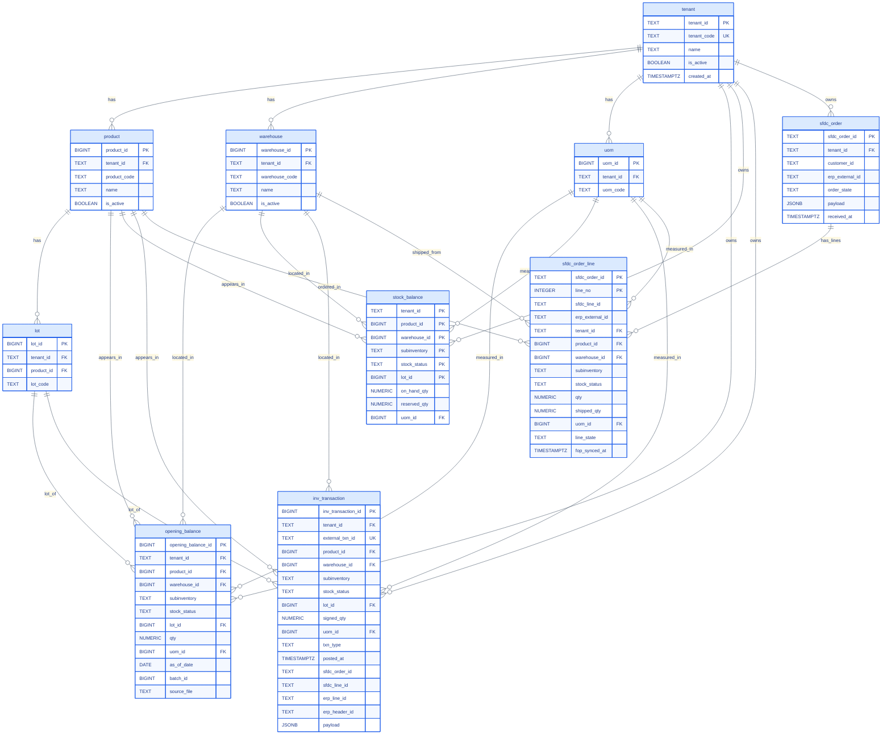
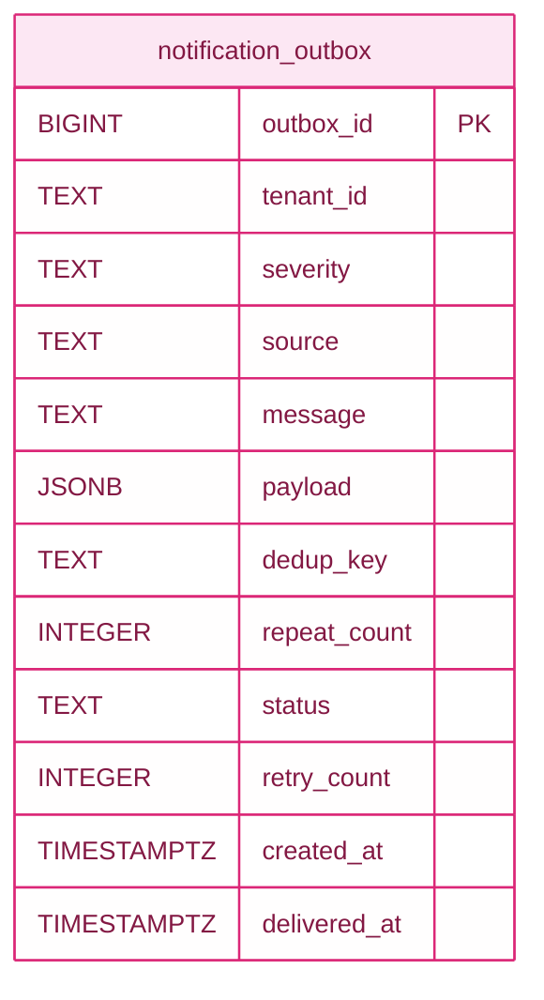

Generated from `deploy/11-06-v6-customer/customer_install.sql`. Covers the `processed` schema (master data + live ledger). Staging inboxes are separate — see [Table reference](/database/tables-reference#staging-schema).

## Master data + live ledger

Column notes:

- `tenant.tenant_id` defaults to `gen_random_uuid()::text`
- `inv_transaction.erp_line_id` matches `sfdc_order_line.erp_external_id` (cascade match key)
- `inv_transaction.erp_header_id` matches `sfdc_order.erp_external_id`
- `sfdc_order_line.shipped_qty` auto-closes the line when it reaches `qty`
- `stock_balance.subinventory`, `stock_status`, and `lot_id` are part of the composite PK
- `sfdc_order_line` is FK'd to `sfdc_order` on `sfdc_order_id` (ON DELETE CASCADE), not shown in the ER shape because Mermaid ER can't render composite-FK back-arrows without noise

## Reservation cascade — how the model plays

Two triggers on `inv_transaction INSERT` do the work:

1. **`f_stock_balance_txn_apply`** — updates `stock_balance` for the transaction's `(tenant, product, warehouse, subinventory, stock_status, lot)`. `signed_qty > 0` bumps `on_hand_qty` up; `signed_qty < 0` bumps it down.
2. **`f_stock_balance_reservation_apply`** — if the transaction has an `erp_line_id`, `sfdc_line_id`, or `sfdc_order_id` that resolves to an active `sfdc_order_line`:
   - Updates `sfdc_order_line.shipped_qty += |signed_qty|`.
   - Computes `target = (qty - shipped_qty)` (or 0 if line is now closed/cancelled).
   - `stock_balance.reserved_qty += (NEW_target - OLD_target)`.
   - If `shipped_qty >= qty`, sets `line_state = 'closed'` and `fop_synced_at = now()`.

The formula generalizes across INSERT (new line reserves qty), UPDATE (delta reservation), close (reserved goes to 0), cancel (release), and subinv-move (release from OLD row, reserve on NEW row).

## Match precedence

Cascade uses this precedence to find the target line:

1. **`erp_line_id`** (Oracle `SOURCE_LINE_ID`) — most precise, one shipment → one line
2. **`sfdc_line_id`** (SFDC `Id`) — fallback if FOP hasn't populated erp_line_id
3. **`sfdc_order_id`** (header fallback) — only works for single-line orders

Multi-line orders **require** `erp_line_id` on the txn payload — the header-only path can't disambiguate.

## Notification outbox

Not in the ER because it's operational, not business:

Column notes:

- `severity` — `INFO` / `WARN` / `ERROR`
- `dedup_key` — collapses repeats via `notify_outbox()` function
- `status` — `pending` / `delivered` / `failed` / `failed_permanent`
- `tenant_id` is nullable — system-level events have no tenant

Written by SQL functions via `processed.notify_outbox(...)`; drained by the Java daemon via webhook.

## Audit event log

Not in the ER — see the [Observability](/architecture/observability) doc for the shape. The `audit.event_log` table has no FKs; it's a flat append-only stream.
