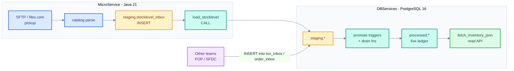

This codebase delivers **two independent projects** that together implement the Inventory Ledger. They build, test, and deploy independently. They communicate through one shared contract: the **PostgreSQL staging schema**.

## 1. MicroService (Java)

**Folder:** `filemanager-core/`  
**Stack:** Java 21 + Maven + raw JDBC. No framework.  
**Deployment:** Long-lived process (K8s Deployment). Internal cron scheduler.

### Owns

- Connecting to files.com (default) or SFTP (fallback) or local folder (dev)
- Picking up Michelin `MICH_INV_STOCKLEVEL_*.cfo` files
- Decoding via the **catalog YAML** (`classpath:interfaces/*.yaml`) — variant detection, positional parse, envelope capture, field mapping, type coercion
- Hash-dedup (skip files already ingested)
- Atomic per-file transaction: write all rows to staging in one commit, or roll back the whole file
- Calling `staging.load_stocklevel(file_name)` to promote the staging rows into the live ledger
- Moving the file to `archive/` (success) or `reject/` (failure)
- Draining `notification_outbox` at the end of each cycle (webhook delivery)
- Writing every file event to `audit.event_log` and a periodic `daemon.heartbeat`
- Exposing `/actuator/health` for K8s probes

### Does NOT own

- Receiving inventory transactions (other team's Oracle→FOP pipeline)
- Receiving Salesforce orders (other team's SFDC integration)
- Any live-table computation (DBServices does that via triggers)
- The ATP calculation logic (DBServices)

### Contract with DBServices

- Reads the catalog YAML to learn target staging table names and column types — the JAR must be rebuilt to add a column, but parser code is never touched
- INSERTs into `staging.stocklevel_inbox` via JDBC
- Calls one promotion function per file: `staging.load_stocklevel(file_name)`
- Reads `notification_outbox` for items needing webhook delivery
- Writes to `audit.event_log` for file lifecycle observability

## 2. DBServices (PostgreSQL)

**Folder:** `deploy/11-06-v6-customer/`  
**Stack:** PostgreSQL 16 (Azure Flexible Server in prod).  
**Deployment:** DBA workflow. Customer applies `customer_install.sql` + `alter_04_audit_event_log.sql` to a clean DB.

### Owns

- All schemas: `staging.*`, `processed.*` (live), `audit.*`
- All staging tables, including the ones populated by other teams: `staging.txn_inbox`, `staging.order_inbox`
- All live tables: `inv_transaction`, `stock_balance`, `opening_balance`, `sfdc_order`, `sfdc_order_line`, `tenant`, plus masters
- All triggers: stock_balance maintenance, cascade reservation, audit
- All stored functions — see [Functions](/database/functions)
- The `notification_outbox` table where PG-side failures get logged for the MicroService to drain

### Does NOT own

- The Java file loader (MicroService)
- HTTP transport for transactions/orders (other teams' services use PG-level access)
- Authentication / authorization at the API tier (caller services' responsibility)

### Contract with Other Teams (FOP, SFDC)

- Provides `staging.txn_inbox` and `staging.order_inbox` — well-documented column lists
- Auto-promote triggers on both tables drain into `processed.*` — no scheduler needed on the caller side
- Exposes [`fetch_inventory_json(...)`](/reference/fetch-inventory-api) for the SFDC read tier

## 3. Other teams' scope (NOT us)

| Team | Pipeline | What they do | Our touchpoint |
|---|---|---|---|
| FOP | Inventory transactions | INSERT rows into `staging.txn_inbox` from their own REST handler or batch | We provide the table + `f_promote_txn` trigger |
| SFDC | Salesforce orders | INSERT rows into `staging.order_inbox` from their integration | We provide the table + `f_promote_order` trigger |
| SFDC | Inventory read | Call `fetch_inventory_json(...)` via their own access path (PostgREST / Heroku Connect / direct) | We expose the function; auth is theirs |

**We do NOT build:** a Java REST endpoint for transactions, orders, or fetch_inventory. No auth tier.

## 4. Build / deploy independence

| | MicroService | DBServices |
|---|---|---|
| Build | `mvn -pl filemanager-core verify` | (SQL — no build) |
| Test | `mvn test` (unit) + `verify` (IT via Testcontainers) | `psql -f test_v6_full_suite.sql` |
| Deploy | Shaded JAR to K8s Deployment | `psql -f customer_install.sql -f alter_04_audit_event_log.sql` |
| Owner | App team | App team (schema + functions are app-team-owned; ops applies them) |
| Schedule | Internal cron (`SCHEDULE_DAILY`, `SCHEDULE_HOURLY`) | No cron in v6 customer package (customer scheduler handles maintenance) |

## Quick reference

| Question | Answer |
|---|---|
| Who reads the file from files.com? | **MicroService** |
| Who owns the interface catalog YAML? | **MicroService** (schema shipped in the JAR) |
| Who writes to `staging.stocklevel_inbox`? | **MicroService** |
| Who writes to `staging.txn_inbox`? | **FOP** |
| Who writes to `staging.order_inbox`? | **SFDC** |
| Who writes to `processed.inv_transaction`? | **DBServices** (via `f_promote_txn` trigger) |
| Who calls `fetch_inventory_json(...)`? | **SFDC read tier** via their own access path |
| Who drains `notification_outbox`? | **MicroService** (at end of each ingest cycle) |
| Who writes to `audit.event_log`? | **MicroService** (file events + heartbeat) + `fetch_inventory_json_observed` wrapper |
